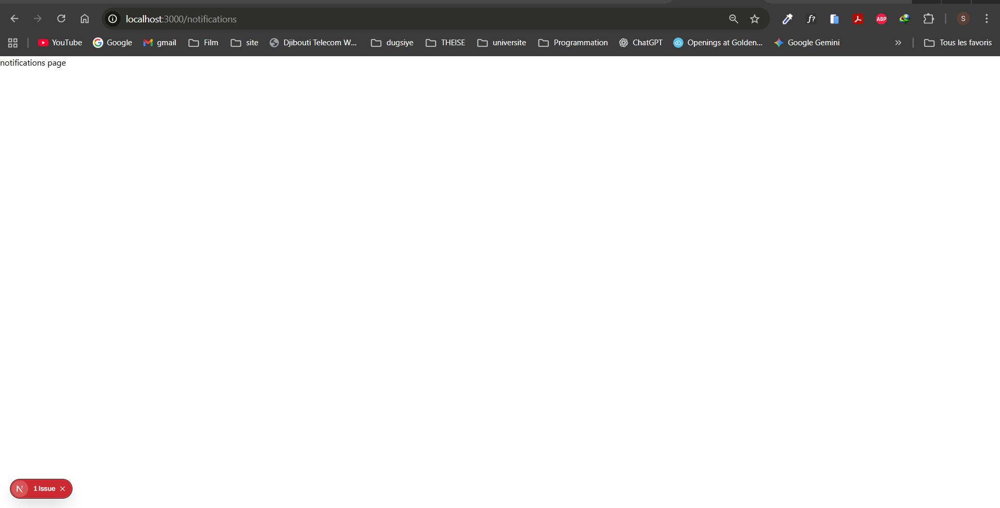
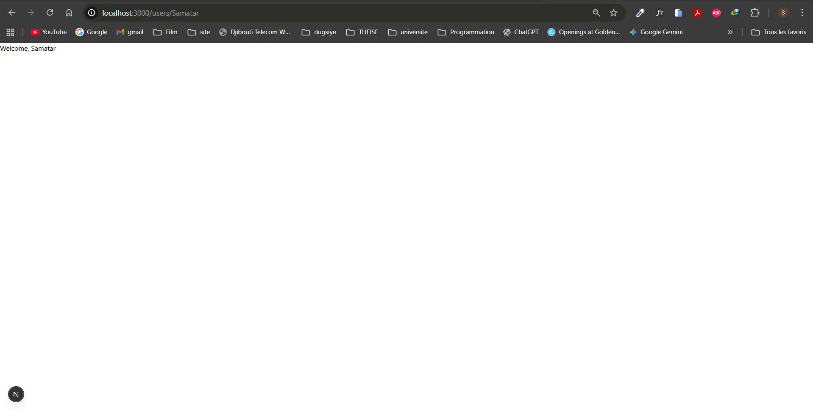
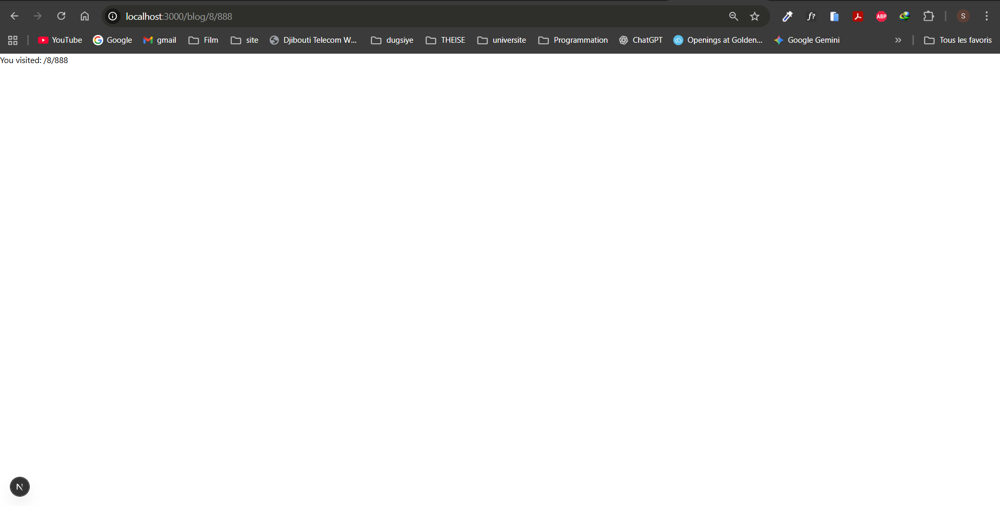
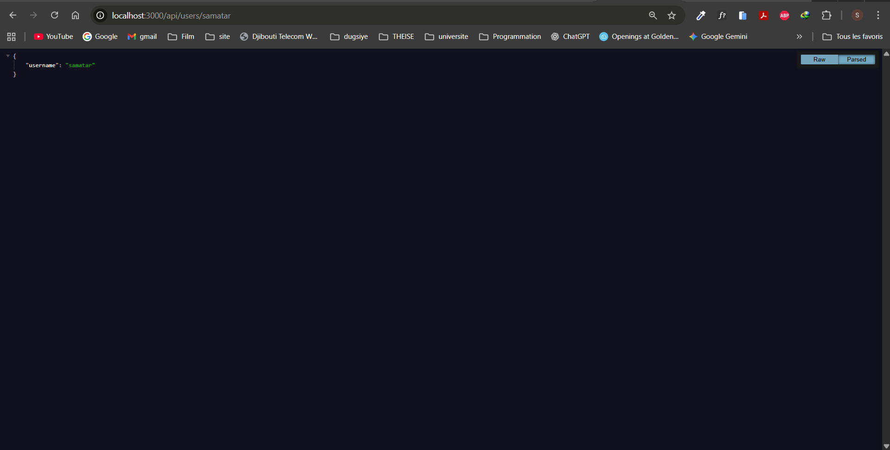

# exercise_1

## 1. Grouped Routes
### - Create: `(dashboard)/notifications/page.tsx`
### - Confirm URL is `/notifications` (no "dashboard")

## 2. Dynamic User Route
### Create: `users/[username]/page.tsx`
### Render: `Welcome, {username}`

## 3. Catch-All Blog Route

### Create: `blog/[[...slug]]/page.tsx`
### Show: `You visited: /{slug}`

## 4. API User Profile

### Create: `api/users/[username]/route.ts`
### Return: `{ username: "..." }`
